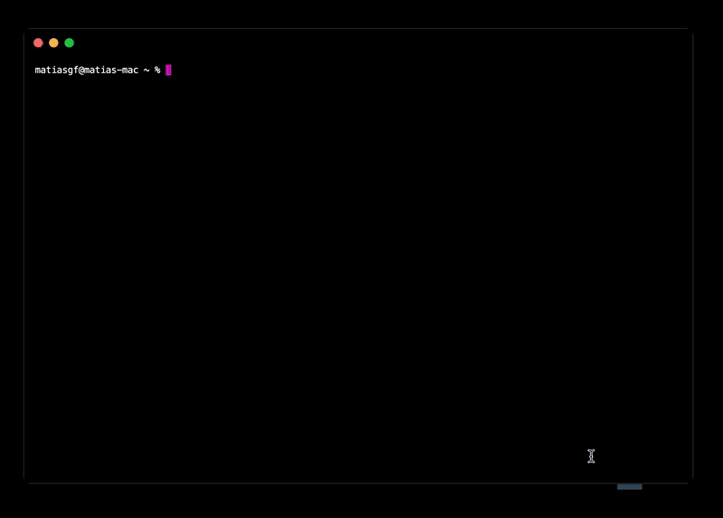

# Terminal rush

Run > `npx terminal-rush` to start the game.

  

## How does it work

This game is build with [react-three-fiber](https://github.com/pmndrs/react-three-fiber), [drei](https://github.com/pmndrs/drei). Since simulating the dom on nodsj is quite impractical (I tried many libraries but the compatibility was not good), I decide that the game would run on a real browser and using [puppeteer](https://github.com/puppeteer/puppeteer) I took screenshots of the screen to display the result on the user's terminal.

To handle all of this, I created this monorepo that contains:

- `packages/virtual-app`: The "real" game, it can run on the browser using vite to debug, and it can also be compiled to use by the terminal-rush package.
- `packages/compiler`: A package that uses webpack to bundle everything together. It has a "router" so that I can create the scenes for the cli game similar to creating pages on `next.js`.
- `packages/core`: The CLI package, it uses [react-ink](https://github.com/vadimdemedes/ink) to render the game on the terminal.
- `apps/sandbox`: A sandbox to test installing and running the game.
